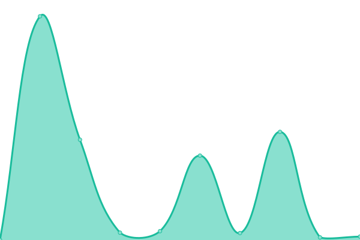
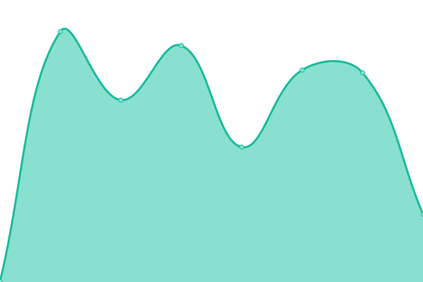
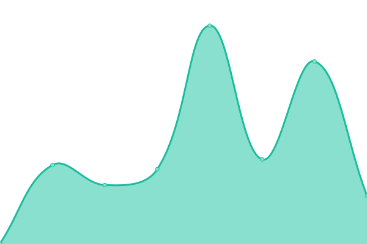
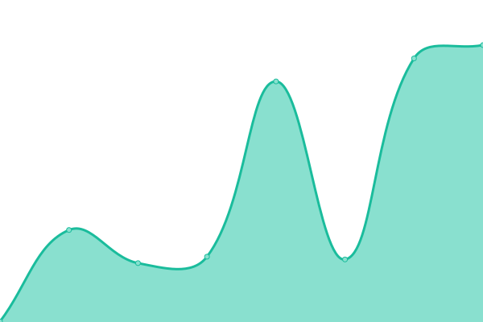
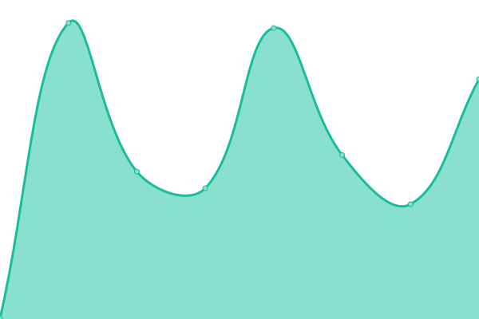
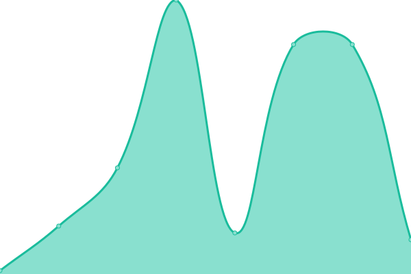

# [📈 Live Status](https://vcoud.github.io/upptime): <!--live status--> **🟧 Partial outage**

This repository contains the open-source uptime monitor and status page for [Corporación Vcoud, C.A.](https://vcoud.com), powered by [Upptime](https://github.com/upptime/upptime).

With [Upptime](https://upptime.js.org), you can get your own unlimited and free uptime monitor and status page, powered entirely by a GitHub repository. We use [Issues](https://github.com/vcoud/upptime/issues) as incident reports, [Actions](https://github.com/vcoud/upptime/actions) as uptime monitors, and [Pages](https://vcoud.github.io/upptime) for the status page.

<!--start: status pages-->
<!-- This summary is generated by Upptime (https://github.com/upptime/upptime) -->
<!-- Do not edit this manually, your changes will be overwritten -->
<!-- prettier-ignore -->
| URL | Status | History | Response Time | Uptime |
| --- | ------ | ------- | ------------- | ------ |
|  [Criptodolar & Covid API](https://exchange.vcoud.com/) | 🟩 Up | [criptodolar-and-covid-api.yml](https://github.com/vcoud/upptime/commits/HEAD/history/criptodolar-and-covid-api.yml) | 

 338ms
     
 | 

<a href="https://vcoud.github.io/upptime/history/criptodolar-and-covid-api">100.00%</a>
    

|  [Beisbol API](https://beisbol.vcoud.com/) | 🟩 Up | [beisbol-api.yml](https://github.com/vcoud/upptime/commits/HEAD/history/beisbol-api.yml) | 

 306ms
     
 | 

<a href="https://vcoud.github.io/upptime/history/beisbol-api">100.00%</a>
    

|  [Criptodolar](https://criptodolar.net) | 🟩 Up | [criptodolar.yml](https://github.com/vcoud/upptime/commits/HEAD/history/criptodolar.yml) | 

 571ms
     
 | 

<a href="https://vcoud.github.io/upptime/history/criptodolar">100.00%</a>
    

|  [Vcoud](https://vcoud.com) | 🟩 Up | [vcoud.yml](https://github.com/vcoud/upptime/commits/HEAD/history/vcoud.yml) | 

 374ms
     
 | 

<a href="https://vcoud.github.io/upptime/history/vcoud">100.00%</a>
    

|  [Farming Simulator App](https://farmingsimulator.app/en) | 🟩 Up | [farming-simulator-app.yml](https://github.com/vcoud/upptime/commits/HEAD/history/farming-simulator-app.yml) | 

 578ms
     
 | 

<a href="https://vcoud.github.io/upptime/history/farming-simulator-app">100.00%</a>
    

|  [Unainversion](https://unainversion.com) | 🟩 Up | [unainversion.yml](https://github.com/vcoud/upptime/commits/HEAD/history/unainversion.yml) | 

 566ms
     
 | 

<a href="https://vcoud.github.io/upptime/history/unainversion">100.00%</a>
    

|  [Tiendakapuy](https://tiendakapuy.com) | 🟩 Up | [tiendakapuy.yml](https://github.com/vcoud/upptime/commits/HEAD/history/tiendakapuy.yml) | 

 412ms
     
 | 

<a href="https://vcoud.github.io/upptime/history/tiendakapuy">100.00%</a>
    

|  [Gamepasslist](https://gamepasslist.app) | 🟩 Up | [gamepasslist.yml](https://github.com/vcoud/upptime/commits/HEAD/history/gamepasslist.yml) | 

 563ms
     
 | 

<a href="https://vcoud.github.io/upptime/history/gamepasslist">100.00%</a>
    

|  [19Stats](https://covid19stats.live) | 🟥 Down | [19-stats.yml](https://github.com/vcoud/upptime/commits/HEAD/history/19-stats.yml) | 

 381ms
     
 | 

<a href="https://vcoud.github.io/upptime/history/19-stats">0.00%</a>
    

|  [Headlines API](https://headlines-api.gunow.co/) | 🟩 Up | [headlines-api.yml](https://github.com/vcoud/upptime/commits/HEAD/history/headlines-api.yml) | 

 280ms
     
 | 

<a href="https://vcoud.github.io/upptime/history/headlines-api">100.00%</a>
    

|  [Gamepasslist API](https://headlines-api.gunow.co/) | 🟩 Up | [gamepasslist-api.yml](https://github.com/vcoud/upptime/commits/HEAD/history/gamepasslist-api.yml) | 

 66ms
     
 | 

<a href="https://vcoud.github.io/upptime/history/gamepasslist-api">100.00%</a>
    

<!--end: status pages-->

[**Visit our status website →**](https://vcoud.github.io/upptime)

## 📄 License

- Powered by: [Upptime](https://github.com/upptime/upptime)
- Code: [MIT](./LICENSE) © [Corporación Vcoud, C.A.](https://vcoud.com)
- Data in the `./history` directory: [Open Database License](https://opendatacommons.org/licenses/odbl/1-0/)
